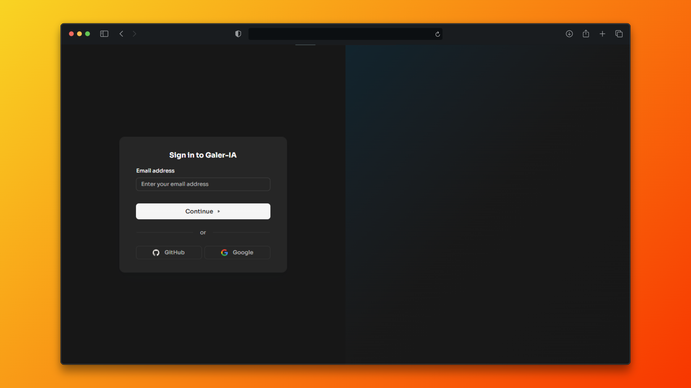

# 🚀 Proyecto: GalerIA ✨🤖🖼️

**GalerIA** es una plataforma web que permite generar imágenes mediante inteligencia artificial utilizando prompts personalizados y estilos artísticos variados. Cada imagen generada se guarda automáticamente en tu galería personal, donde puedes organizar, revisar y compartir tus creaciones con quien desees.

Además, GalerIA cuenta con una sección de comunidad, donde puedes explorar las imágenes generadas por otros usuarios, inspirarte con sus ideas y conectar a través del arte generado por IA.

## ✨ Características

🧠 Generación de imágenes a partir de texto (prompts).

🎨 Selección de estilos artísticos para personalizar tus resultados-

🖼️ Galería personal para gestionar tus creaciones.

🌍 Comunidad para descubrir imágenes de otros usuarios.

🔗 Compartir fácilmente tus obras con un enlace.

## 🌐 Enlaces

🔗 Enlace al proyecto: [GalerIA](https://galer-ia.vercel.app)

📁 Repositorio público: [GitHub](https://github.com/Alexisxde/galer-ia)

## 📸 Capturas de pantalla




## 🛠️ Tecnologías utilizadas

- [Astro](https://astro.build/) – Framework web para contenido veloz
- [React](https://reactjs.org/) – Componentes interactivos
- [Tailwind](https://tailwindcss.com/) – Estilos rápidos y responsivos
- [Clerk](https://clerk.dev/) – Autenticación de usuarios
- [Turso](https://turso.tech/) – Base de datos edge rápida
- [Drizzle ORM](https://orm.drizzle.team/) – ORM para consultas

## 🔐 Uso de Clerk

GalerIA utiliza **Clerk** como sistema de autenticación principal. Esto permite:

- Registro e inicio de sesión de usuarios con OAuth (GitHub y Google).
- Protección de rutas de usuario (solo usuarios logueados pueden generar imágenes).
- Middleware en Astro para proteger páginas específicas.

🧪 ¿Cómo correr el proyecto localmente?

```bash
git clone https://github.com/Alexisxde/galer-ia.git
cd galer-ia
pnpm install
pnpm dev
```

Configura las variables de entorno en el .env.

## 👨‍💻 Equipo

- Proyecto individual desarrollado por [Olivarez Alexis](https://alexisxde.github.io)

Este proyecto fue creado para la Hackaton de **midudev - Clerk** 🚀
